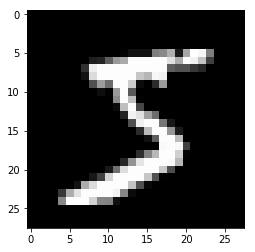

# Title


### Foward and backward passes

```python
# export
from exp.nb_MatrixExample import *

def get_data():
    """
    Grab MNIST data using path
    """
    path = datasets.download_data(MNIST_URL, ext='.gz')
    with gzip.open(path, 'rb') as f:
        (x_train, y_train),(x_valid, y_valid), _ = pickle.load(f, encoding='latin-1')
    return map(tensor, (x_train,y_train, x_valid,y_valid))

def normalize(x,m,s): return (x-m) / s
```

Let's grab for this example [MNIST](http://yann.lecun.com/exdb/mnist/) data. MNIST data is a popular dataset for machine learning and deep learning and conists of handwritted digits from 0 to 9. By modern standards the dataset is considered to be trivial with many algorithms reaching >99% test accuracy.

 MNIST has a training set of 60,000 examples, and a test set of 10,000 examples.
 
 There are many different ways to grab MNIST dataset. We leverage FastAI `datasets`

```python
x_train, y_train, x_valid, y_valid = get_data()
```

```python
x_train.shape, x_valid.shape
```


    (torch.Size([50000, 784]), torch.Size([10000, 784]))


Our training set has 50 000 observations, each observation has 784 data points. This represents flattened 28 x 28 pixels of the resulting image. We can convert 784 vector back to a matrix form and plot it for vizualization

```python
mpl.rcParams['image.cmap'] = 'gray'

plt.imshow(x_train[0].view(28,28));
```





### Preparing the data

As a usual first step we normalize our data - subtract the mean and divide by the standard deviation of the __train dataset__. it is important to use the same mean and standard deviation while normalizing training and validation / test data

```python
train_mean, train_std = x_train.mean(), x_train.std()
train_mean, train_std
```


    (tensor(0.1304), tensor(0.3073))


```python
# normalizing the data
x_train = normalize(x_train, train_mean, train_std)
x_valid = normalize(x_valid,train_mean, train_std)
```

```python
# export
def near_zero(a, tol=1e-3): assert a.abs() < tol, f"Near zero: {a}"
```

```python
near_zero(x_train.mean())
near_zero(1 - x_train.std())
```

```python
n,m = x_train.shape
c = y_train.max() + 1
n,m,c
```


    (50000, 784, tensor(10))


